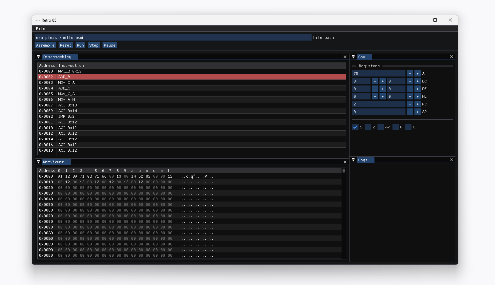

Retro85
---

Retro85, as the name suggests, is an [Intel 8085](https://en.wikipedia.org/wiki/Intel_8085) cpu emulator and simulator written in C++.
It features a very intuitive and easy to use graphical application, a built-in debugger, ~assembly code editor~ and many other features.

The goal is to try as much as possible to emulate and implement _all_ the aspects of the microprocessor.
From the instruction set, to cpu cycles to io devices.

While the development of this software is solely for recreational purposes, I believe it can be used as a teaching tool for those who are not fortunate enough
to own a  physical training kit.

*While the core functionality is almost done, this software is still in development. Feel free to play around with it and give feedback.*

# Tech stack

- C++
- dearimgui

# Build and running

Open `Developer Command Prompt for VS 2022` and Run:

- `build_gui.bat` to build the gui app
    - This will generate `retro85.exe` executable file

- `build_cli.bat` to build the cli app
    - This will generate `retro85a.exe` executable file that you can, for now, use to assemble and disassemble programs
    - Run `retro85a.exe` for help

# Features / Road map / Ideas

- Code editor
- Step through code
- IO Drivers?
    - 'IO Devices' will be assigned a part of the memory where they'll be able to read and write
- Cross platform
    - [ ] Windows
    - [ ] Linux
    - [ ] MacOS
    - [ ] Web

*I'm taking feature requests or ideas on how to make it better*

# Author

[James Njenga](jnjenga.com)

## Feedback

If you have any feedback, please reach out to me via mail `me at jnjenga.com`
  
## Contributing

Contributions are always welcome!
